# Schwifty Dealership Management

Team:

- Chad - Services Microservice
- Jason - Sales Microservice

## Design

When a user opens the site, from the homepage, they should have dropdowns to each category of stuff that they have access to; services, sales, and inventory.

Off of the services dropdown, they should be able to:

- Create a Technician
- Show Appointments
- Create an Appointment
- Show Appointment History

Off of the sales dropdown, they should be able to:

- Create a New Salesperson
- Create a New Customer
- Create a New Sales Record
- Show a Sales List
- Get the Sales History of a Salesperson

Off of the inventory dropdown, they should be able to:

- Show Manufacturers
- Create Manufacturers
- Show Vehicle Models
- Create Vehicle Models
- Show Automobiles
- Create Automobiles
  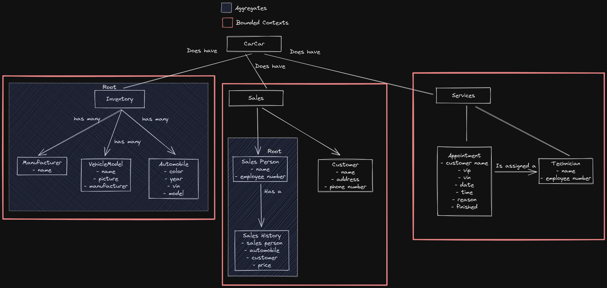

## Service microservice

The Service functionality needs to keep track of service appointments for automobiles and their owners, along with being able to create technicians to then assign to an appointment.

So the models I will be making are a technician model and an appointment model. I will also be making an AutomobilieVO model that will be storing the data that I need from the Automobile model from the Inventory microservice.

In order to grab that data, I will be using polling, to poll the Inventory database for the data I need and assigning it to the AutomobileVO model fields.

## Sales microservice

The sales microservice records a salesperson's automobile sales, tracking the movement of what is in the vehicle inventory. The models required will be a Salesperson, Customer, and a Sales record. The Sales record model will poll for for data in the microservice to pull data from the main inventory application.

## Building and running the project
First, make sure you have Docker installed on your machine.
[Docker Download](https://docs.docker.com/get-docker/)

Start Docker on your machine.

In your terminal, clone down the repository.    
`git clone <clone url here>`

CD into the directory that was made when you cloned down the repository.  

In your terminal, run this command to create a new volume that Docker can use for this project.  
`docker volume create beta-data`

Now run this command to build a new Docker Container.  
`docker compose build`

Finally run this command to bring the container that was just made up.  
`docker compose up`

In your browser, navigate to `http://localhost:3000` to view the application.

# Visuals of the site structure
## Homepage
Homepage
 

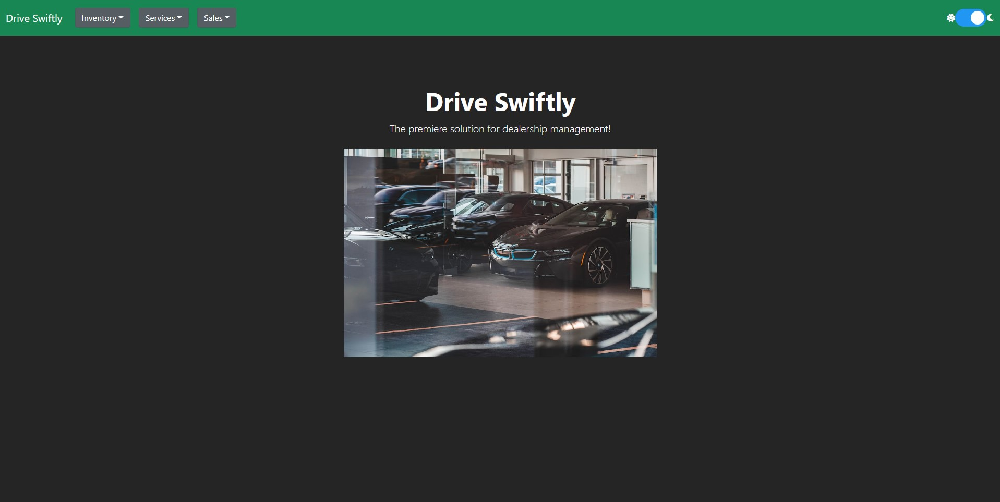

## Inventory
This section of the site allows you to create automobiles, manufacturers and models. You can also see a list of all the automobiles, manufacturers, and models that are currently in the database.
 

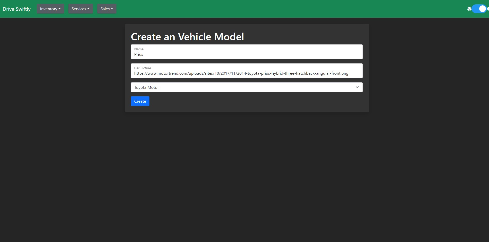
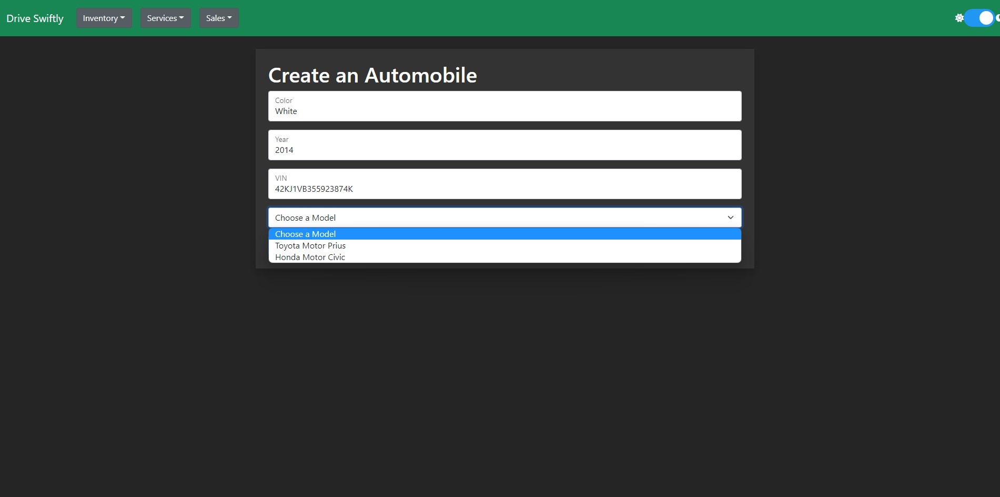
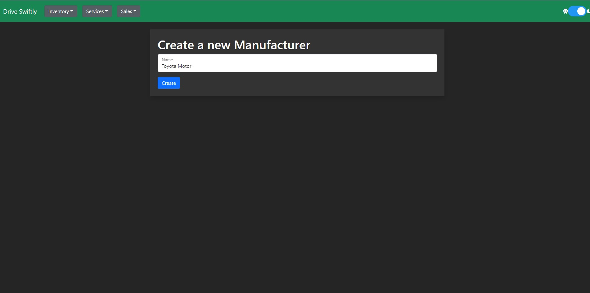
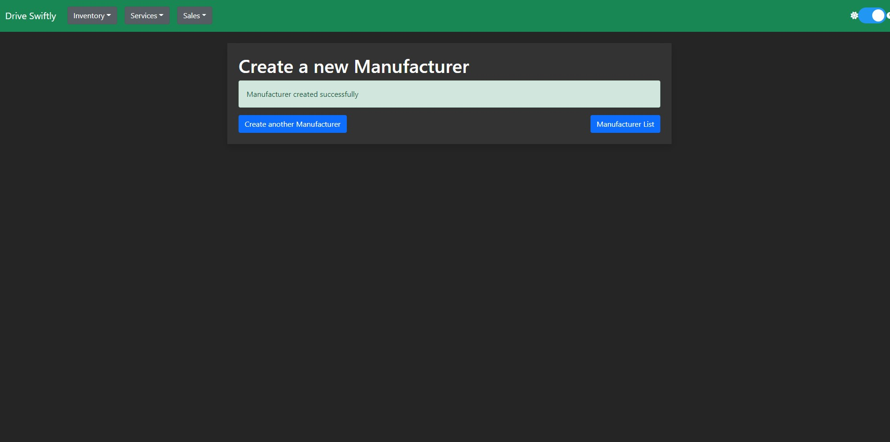
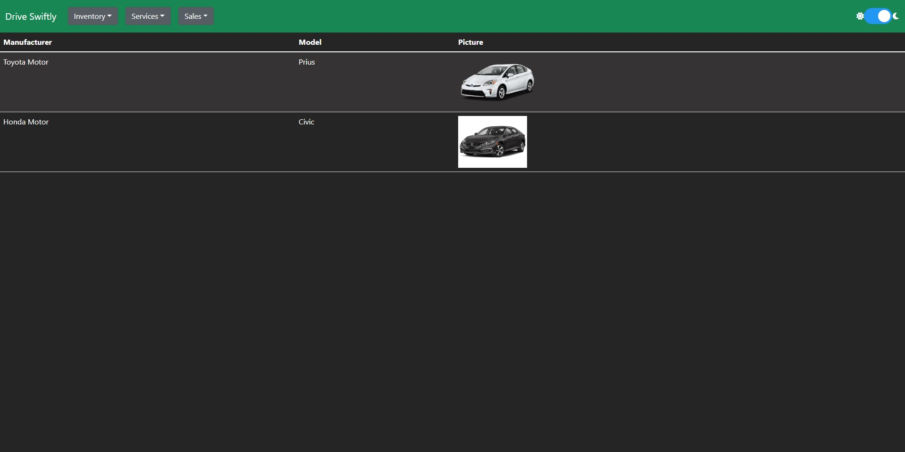
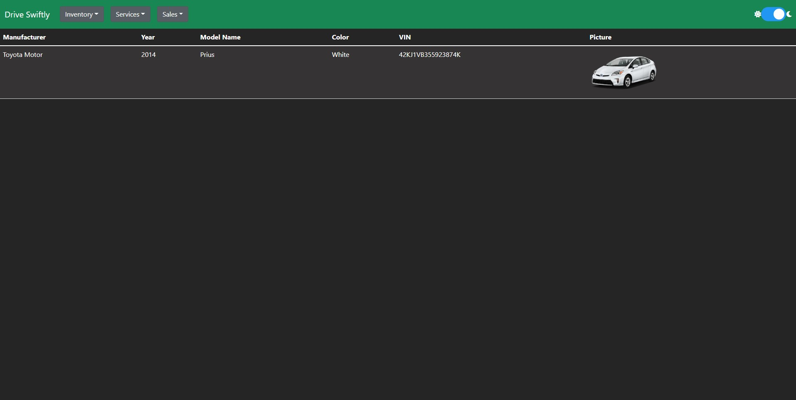
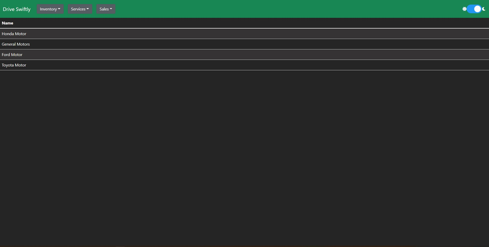

## Services
This part of the site allows you to add techicians to the staff and add appointments for customers, assign technicians to those appointments, finish an appointment, and see all the appointments a specific vehicle VIN number has had.
 

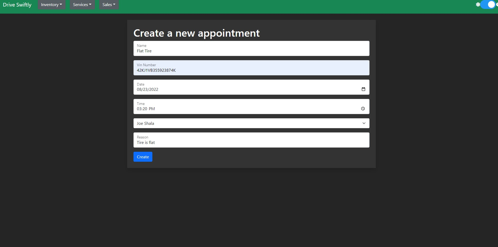
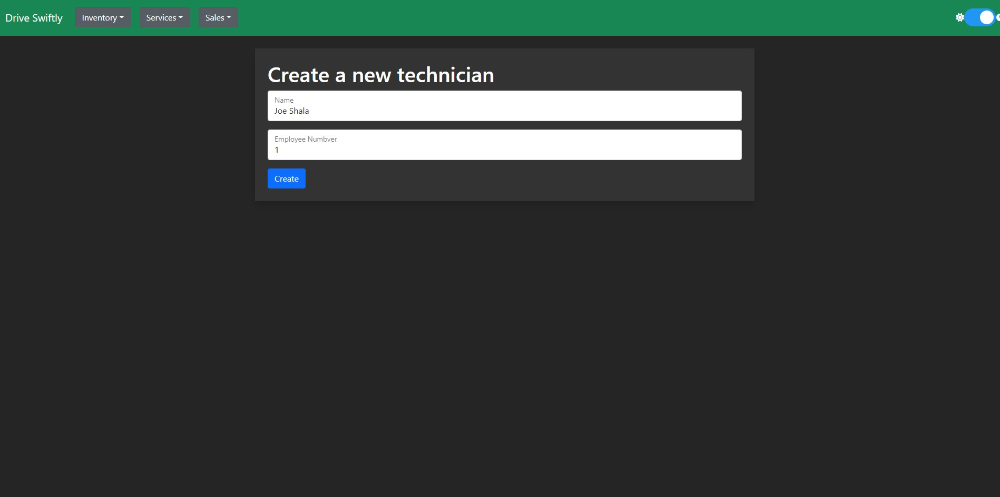
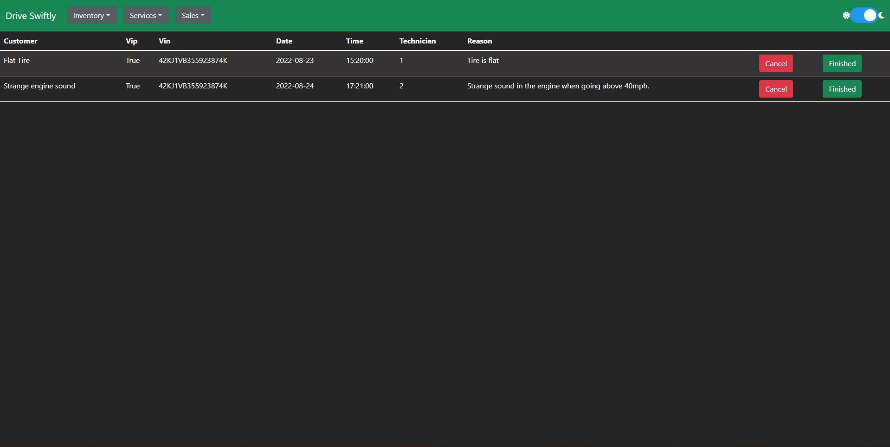
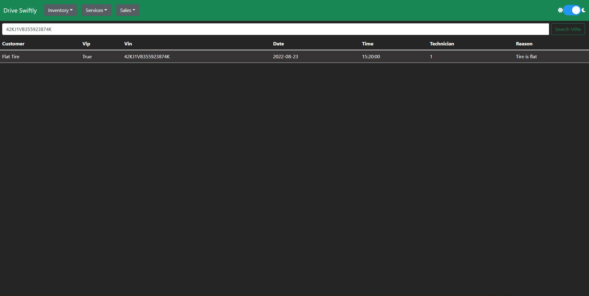

## Sales
The sales section of the site allows you to create new sales staff, see a list of all the sales staff, see a salesperson's sales history add in customers, see a list of customers, and create a sales record for a customer.

 

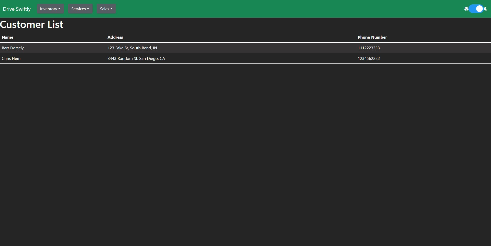
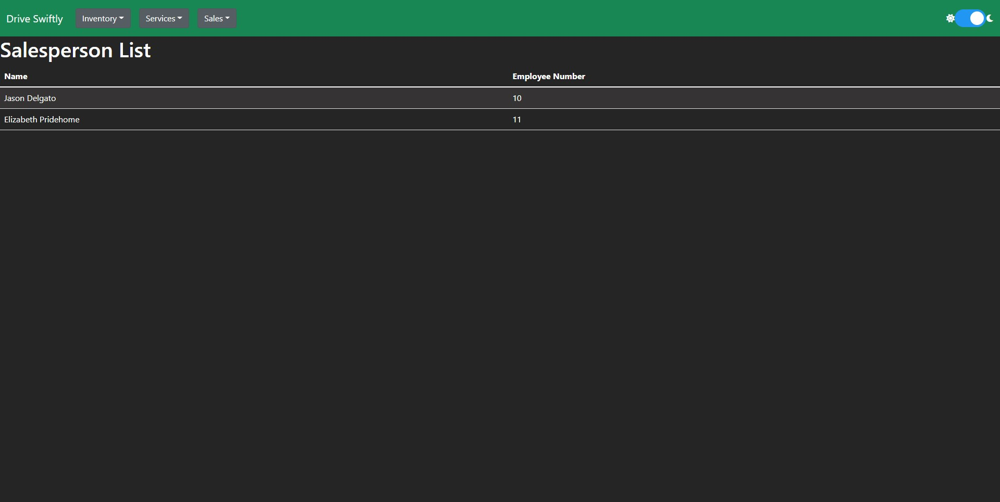
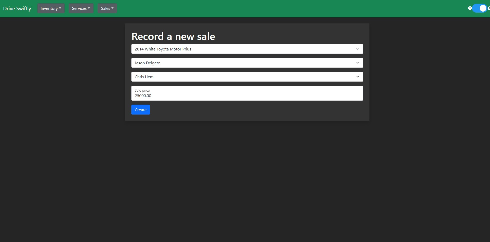
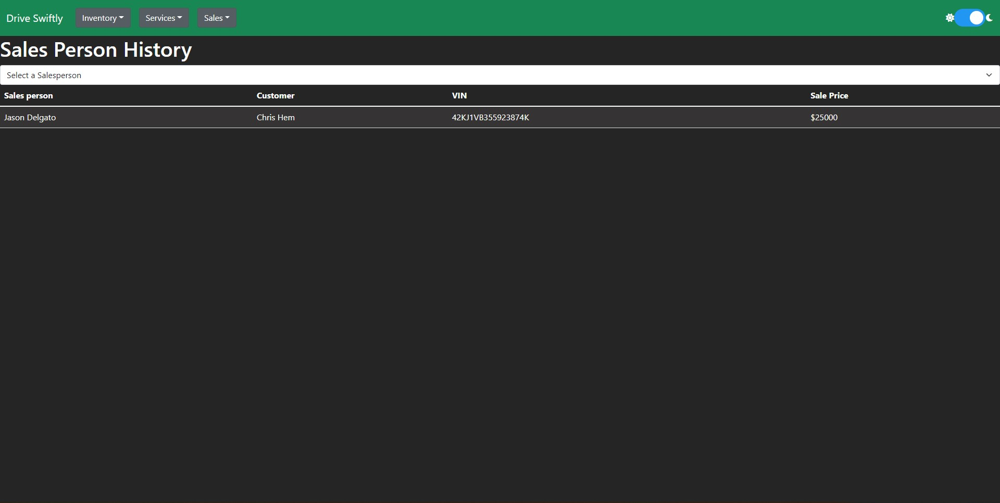

